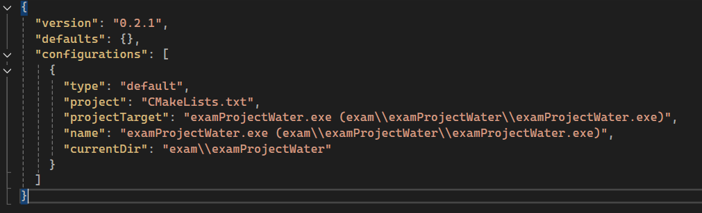

## Graphics Programming Exam

### How to run
To run this remember to add a debug configuration.

In Visual Studio this is done by

1. Clicking on 'switch between solution and available views' in the Solution Explorer.
2. Click on 'CMake Targets View'
3. Find the executable for 'examProjectWater'
4. Right click on it and select 'Add Debug Configuration'
5. In the json file that opens, add the line "currentDir": "exam\\examProjectWater" to the configurations

Once this is done use cmake to build the project, and then run the executable.

## How to use 
Once the program is running, you can use the following keys to control the simulation:
- `W` - Move the camera forward
- `S` - Move the camera backward
- `A` - Move the camera left
- `D` - Move the camera right

Use the mouse to look around the scene. The camera will move in the direction it is facing.

Press `Space` to toggle camera mouse movement.

Use the GUI windows to control the simulation parameters for the water and light caustics.
